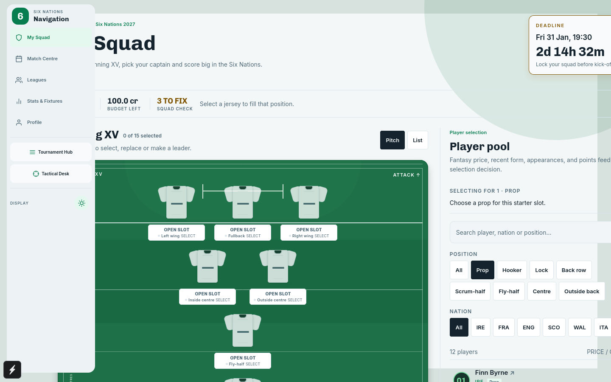
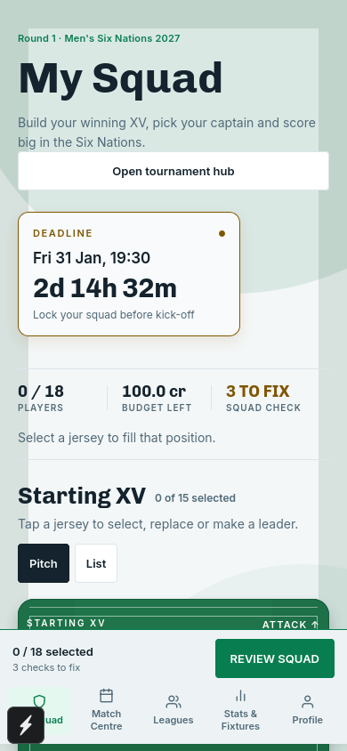

# 6Nations: first frontend slice

An Expo/React Native/TypeScript squad builder for web, iOS and Android. With the public Supabase variables configured, it provides persistent email/password authentication; without them, it remains an honest local demo.

## Run on web

Use the repository's Node version (22.20.0) and run from the repository root:

```sh
cd ~/Projects/6Nations
npm ci
npm run dev:web
```

Open the URL printed by Expo, normally **http://localhost:8081**. If another server uses that port, Expo will offer another port; use its printed URL. Stop the server with Ctrl+C. Existing backend containers can stay running.

## Current app screenshots

These captures show the current demo build at desktop and mobile widths:





They were captured from the local Expo demo build with Playwright at 1440px and 390px widths.

### Connect a physical phone with Expo Go

Use the LAN-specific frontend command from the repository root:

```sh
npm run mobile --workspace @six-nations/frontend
```

The phone and workstation must be on the same Wi-Fi network. If the QR code still cannot load, use the slower tunnel fallback:

```sh
npm run mobile:tunnel --workspace @six-nations/frontend
```

For a phone to complete sign-in/onboarding, `EXPO_PUBLIC_API_URL` must point to the workstation's LAN address, not `localhost`. The local development setup uses the mobile Compose override:

```sh
docker compose --env-file backend/.env -f backend/compose.yaml -f backend/compose.mobile.yaml up -d api
```

Update `frontend/.env.local` whenever the workstation's LAN address changes, then restart Expo so public environment variables are rebundled. The current machine address is an example only; find yours with `hostname -I`.

### Try the current command-centre slice

1. Click an empty pitch slot. The player pool filters to that starter position. Click `+` to select a player; the next empty slot becomes active automatically.
2. Fill 15 starters and three reserves, or click **Load example squad** for a legal starting point.
3. Click a selected starter and choose **Captain** or **Vice-captain** in the player-pool panel. They must be different starters.
4. Use the bench arrows to change reserve priority. Use **List** for the pitch alternative.
5. Click **Review squad**. Missing slots, captaincy, a cost above 100 credits or more than four players from one nation prevent confirmation. Premium players let you explore budget errors.
6. Click **LOCK XV** to persist the locked state. While locked, roster, captaincy, bench, and transfer actions are disabled; reload to verify lockout enforcement.
7. Open **Tournament Hub** for round snapshot, lockout, rank, match centre, leagues, stats, and rules navigation. Open **Tactical Desk** for captain multiplier, vice-captain fallback, compliance audit, nation distribution, and the **Transfer Market**.
8. Use the bench **Swap with starter** action for a compatible reserve, and inspect player details for fantasy points, form, appearances, nation, shirt number, and price.
9. Test player search, position and nation filters, player details, and an unmatched search. **Clear draft** asks before clearing local data.

Draft changes save automatically to browser storage. Wait for **Saved on this device** before closing. Saving is local to each browser/device and origin; `localhost` and `127.0.0.1` have separate drafts. Private browsing, cleared site data, or storage restrictions can remove/block saves. A storage error is shown and confirmation does not claim success when saving fails.

After initial assets load, selecting and saving does not need an API connection. This is not a packaged offline web app: a first visit or uncached reload still needs the web server. No offline submissions are queued.

### Configure authentication

Copy `frontend/.env.example` to a local environment file and set `EXPO_PUBLIC_SUPABASE_URL`, `EXPO_PUBLIC_SUPABASE_PUBLISHABLE_KEY`, and `EXPO_PUBLIC_API_URL`. Configured builds redirect signed-out users to `/sign-in`; users can sign in or create an account, and sessions persist through reloads. Onboarding profile data is sent to the authenticated backend. If the API has no published season/player catalog, the squad screen shows an empty server-data state instead of loading synthetic players. Supabase email confirmation settings must match the deployed app’s redirect configuration.

## Run on iOS / Android

From the repository root:

```sh
npm run dev:frontend
```

- Install an **Expo Go version compatible with SDK 57** on your phone. The development server and phone should be on the same network.
- **iPhone:** scan the terminal QR code with Camera and open in Expo Go.
- **Android:** scan the QR code inside Expo Go.
- If Expo Go reports an unsupported SDK, use the SDK-compatible version described at https://expo.dev/go, or create a development build. Physical iOS devices normally use the current App Store Expo Go release; availability of an older compatible version is restricted.
- **Android emulator:** install/configure Android Studio and start an emulator, then press `a` in the Expo terminal.
- **iOS simulator:** requires macOS and Xcode. Press `i` in the Expo terminal. This Linux workspace cannot run an iOS simulator.

Repeat the web journey on a device, including reopening the app and large-text/screen-reader checks. These instructions do not claim native devices have been tested.

## Automated checks

```sh
npm run verify:frontend
```

This runs TypeScript checking, squad rule tests and an export to `frontend/dist/`.

Browser acceptance tests use Playwright and a local Expo server on port 8081:

```sh
cd frontend
npx playwright install firefox
npm run test:web
```

If Firefox is already installed, you can provide its executable instead of installing Playwright's Firefox:

```sh
PLAYWRIGHT_FIREFOX_EXECUTABLE_PATH=/usr/bin/firefox npm run test:web
```

The test server shuts down after the run. Use a free port 8081 and stop an existing incompatible Expo project first.

## Boundaries

When `EXPO_PUBLIC_API_URL` is absent, the included player pool and preview points are synthetic local fixtures for UI development. When it is present, authenticated onboarding is server-backed and the squad surface waits for the authoritative season/player API rather than using those fixtures. Squad confirmation and provider-backed scoring remain the next backend integration slice.

`SquadRepository` separates demo data and local persistence from screen behavior. The frontend imports no backend source and contains no privileged keys. Root workspace overrides keep React/React Native and native peer dependencies on one SDK-compatible version.

## Documentation

The current visual and interaction contract is documented in:

- `documentation/design/design-system.md`
- `documentation/design/screens.md`
- `documentation/design/accessibility.md`

The original slice findings and delivery sequence remain in `documentation/delivery/first-frontend-pass.md`; where that historical note says the app is local-only or unauthenticated, the current authenticated/API-aware behavior described above and in the design docs supersedes it.

## Verification results

Verified on 3 October 2026:

- Frontend TypeScript checking and Expo dependency compatibility check pass.
- Nine squad rule tests pass.
- The current browser acceptance suite is environment-sensitive: local demo journeys require Supabase/API variables to be absent, while configured builds correctly enter the sign-in flow. Browser boot has been checked against the configured environment with no console errors.
- Web export succeeds. Desktop (1280 pixels) and narrow (390 pixels) screenshots were reviewed.
- The existing backend verification still passes: 41 tests pass; three Postgres integration tests are skipped by that command without their dedicated test environment. No backend behavior or Supabase schema changed in this pass.

Not verified: actual iOS/Android devices, VoiceOver/TalkBack, a complete accessibility audit or 200% text scaling. A configured Supabase project and production email-confirmation/deep-link settings are also still deployment work.

The workspace dependency audit reports 53 affected entries (44 high, nine moderate), including transitive Expo/router dependencies. These are unresolved; the demo has not been cleared for public release. Some suggested automatic fixes change Expo SDK major versions. SDK migration and dependency remediation need a separate review rather than an untested forced update.
